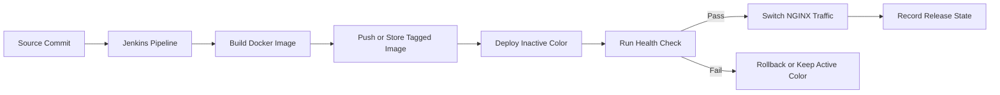

# Zero-Downtime CI/CD Template

Reusable deployment foundation for containerized applications that need safer releases, health-gated traffic switching, and clear operational ownership.

## Current Status

This repository is currently in planning and scaffold stage. It defines the intended scope, architecture, release roadmap, contribution expectations, and governance model for a future implementation. It does not yet provide a complete working CI/CD engine and should not be treated as production-ready.

## Problem Statement

Many teams deploy containerized applications with manual scripts, direct SSH commands, inconsistent environments, or pipelines that stop after a successful image build. That leaves production releases exposed to preventable failure modes:

- user-visible downtime during deployment
- production changes made manually without repeatability
- failed releases with no automated rollback path
- configuration drift between development, staging, and production
- releases promoted without health-check validation
- unclear ownership for release approvals and incident response
- weak discipline around pre-release and stable release criteria

## What This Project Solves

The project is intended to become a reusable template for single-server zero-downtime deployments using Jenkins, Docker, NGINX, and blue/green deployment techniques. The initial focus is a disciplined deployment path that builds and tags container images, deploys a new color beside the active one, validates health checks, switches traffic through NGINX, and rolls back when validation fails.

## Target Users

- platform engineering teams standardizing deployment workflows
- DevOps engineers replacing manual SSH-based releases
- small and mid-sized product teams running containerized applications on virtual machines
- engineering organizations that need release discipline before moving to larger orchestration platforms
- maintainers who want a transparent template for documenting deployment ownership and safety gates

## MVP Scope

The MVP is planned around a single-server deployment model:

- Jenkins pipeline structure for build, tag, deploy, validate, switch, and rollback stages
- Docker image build and immutable tagging conventions
- blue/green application containers on one host
- NGINX traffic switch between active and candidate deployments
- HTTP health-check gate before promotion
- rollback scripts and release state tracking
- separate configuration expectations for development, staging, and production
- documentation-first release process with pre-release criteria

See [docs/MVP.md](docs/MVP.md) for the detailed MVP definition.

## Non-Goals

The initial scope intentionally excludes:

- Kubernetes, Helm, or service mesh orchestration
- multi-region deployment
- autoscaling infrastructure
- a hosted CI/CD product
- complete observability platform implementation
- database migration orchestration
- language-specific application templates
- claims of production readiness before a stable release

## Planned Architecture

The planned architecture uses Jenkins as the release orchestrator, Docker as the packaging and runtime layer, NGINX as the traffic-switching boundary, and health checks as the promotion gate. The deployment target keeps two application colors available so a candidate release can be validated before receiving production traffic.



See [docs/ARCHITECTURE.md](docs/ARCHITECTURE.md) for the initial architecture notes.

## Release Roadmap

- `v0.1.0` - single-server zero-downtime MVP
- `v0.2.0` - deployment governance
- `v0.3.0` - observability and deployment metrics
- `v0.4.0` - canary and smoke testing
- `v0.5.0` - multi-service deployment support
- `v1.0.0` - stable production-ready template

See [docs/RELEASE_PLAN.md](docs/RELEASE_PLAN.md) and [docs/PRE_RELEASE_PLAN.md](docs/PRE_RELEASE_PLAN.md).

## Repository Structure

```text
.
├── docs/
│   ├── AI_AGENT_USAGE.md
│   ├── ARCHITECTURE.md
│   ├── CONTRIBUTING.md
│   ├── MVP.md
│   ├── PRE_RELEASE_PLAN.md
│   ├── REAL_WORLD_PROBLEMS.md
│   ├── RELEASE_PLAN.md
│   └── ROADMAP.md
├── .editorconfig
├── .env.example
├── .gitignore
├── CHANGELOG.md
├── LICENSE
└── README.md
```

## Contribution Note

Contributions should preserve the safety-first purpose of the repository. Deployment logic, scripts, and documentation must be reviewed for operational risk, rollback behavior, secret handling, and environment separation before merge.

See [docs/CONTRIBUTING.md](docs/CONTRIBUTING.md).

## Disclaimer

This repository is not production-ready yet. It is an initial foundation for a future zero-downtime deployment template. Any CI/CD logic added later must be tested in controlled environments before being used for real production systems.
