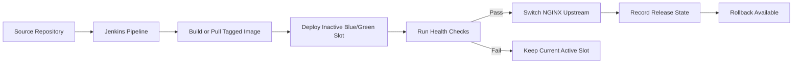

# Zero-Downtime CI/CD Template

A practical, open-source CI/CD template for deploying containerized applications to Linux virtual machines with blue/green releases, NGINX traffic switching, health checks, rollback, and Jenkins pipeline orchestration.

## Current Status

This repository contains the v1.0.0 foundation for a stable VM-based zero-downtime deployment template: configuration, state tracking, health checks, release artifacts, runtime color management, NGINX config generation, traffic switching, rollback, deployment orchestration, and Jenkins examples. Validate the template on target Linux VMs before production use.

Kubernetes is not part of the current implementation. Kubernetes, Helm, and cloud-native deployment workflows are planned for a future `v2.0.0` direction only.

## Who This Is For

This project is intended for:

- DevOps and platform engineers standardizing safer VM deployments
- teams moving away from manual SSH-based production releases
- small and mid-sized engineering teams running services on Linux VMs
- organizations that need release discipline before adopting Kubernetes
- recruiters and reviewers evaluating practical CI/CD, release, and operations design

## What v1.0.0 Will Support

The `v1.0.0` scope is a stable Linux VM deployment template with:

- generic Linux VM deployment model
- Jenkins pipeline integration
- Docker-based application packaging and runtime assumptions
- multi-service blue/green deployment support
- NGINX upstream traffic switching
- HTTP health-check gates before promotion
- rollback to the last known healthy release
- release directory structure and release state tracking
- environment-specific configuration guidance
- operator documentation for setup, deployment, rollback, and troubleshooting

See [docs/RELEASE_SCOPE.md](docs/RELEASE_SCOPE.md) for the authoritative release boundary.

## What v1.0.0 Will Not Support

The `v1.0.0` VM template will not include:

- Kubernetes manifests, Helm charts, operators, or controllers
- service mesh integration
- cloud-provider-specific infrastructure provisioning
- autoscaling orchestration
- multi-region or multi-cluster deployment
- database migration automation
- a hosted CI/CD product
- a full observability platform
- claims that every workload can achieve zero downtime without application-level readiness work

## Architecture Overview

The v1 architecture uses Jenkins as the release orchestrator, Docker as the packaging/runtime layer, NGINX as the traffic boundary, and blue/green deployment slots on one or more Linux VMs. A candidate release is deployed to the inactive slot, validated through health checks, and promoted only after passing the configured gate.



For a deeper design view, read [docs/ARCHITECTURE.md](docs/ARCHITECTURE.md).

## Repository Structure

```text
.
├── Jenkinsfile
├── Makefile
├── config/
│   ├── services.yml
│   ├── environments/
│   └── examples/
├── docs/
│   ├── ARCHITECTURE.md
│   ├── CONFIGURATION.md
│   ├── HEALTH_CHECK.md
│   ├── OPERATIONS.md
│   ├── RELEASE_SCOPE.md
│   └── ROADMAP.md
├── examples/
│   ├── jenkins/
│   ├── mock-artifact/
│   └── mock-health-server/
├── nginx/
│   └── templates/
└── scripts/
    ├── lib/
    ├── deploy.sh
    ├── rollback.sh
    ├── switch-traffic.sh
    └── validation, release, runtime, health, and NGINX helpers
```

## Deployment Command

The main v1 deployment entrypoint is:

```bash
./scripts/deploy.sh billing-api examples/mock-artifact --dry-run
./scripts/deploy.sh billing-api examples/mock-artifact
```

The deploy command targets the inactive blue/green color, validates health before switching traffic, and leaves the old color running until explicitly stopped. Jenkins integration examples are provided through the root `Jenkinsfile` and `examples/jenkins/`.

## Jenkins Integration

The root `Jenkinsfile` provides a declarative pipeline example with parameters for `SERVICE_NAME`, `ARTIFACT_PATH`, `DEPLOY_ENV`, `DRY_RUN`, and `AUTO_APPROVE`.

Recommended branch flow:

```text
develop -> main -> tag v1.0.0
```

Use dry-run by default, require manual approval for production, and run rollback manually after reviewing logs.

## Quick Start Plan

The intended path for contributors, reviewers, and operators is:

1. Read [docs/RELEASE_SCOPE.md](docs/RELEASE_SCOPE.md) to understand what belongs in `v1.0.0`.
2. Review [docs/ARCHITECTURE.md](docs/ARCHITECTURE.md) for the VM-based deployment model.
3. Run `make validate-config` and `make lint-shell` before changing release or deployment scripts.
4. Use [docs/OPERATIONS.md](docs/OPERATIONS.md) for dry-run, deploy, rollback, and Jenkins operating guidance.
5. Follow [docs/ROADMAP.md](docs/ROADMAP.md) when proposing features so Kubernetes work stays in future `v2.0.0` scope.

## Release Roadmap

- `v0.x` - planning, scaffolding, and validated increments toward the VM template
- `v1.0.0` - stable Linux VM zero-downtime CI/CD template
- `v1.x` - hardening, examples, compatibility improvements, and operational polish
- `v2.0.0` - Kubernetes-native roadmap target using Kubernetes, Helm, and cloud-native deployment workflows

See [docs/ROADMAP.md](docs/ROADMAP.md) for the full public roadmap.

## Contribution Note

Contributions should preserve the safety-first purpose of the repository. Deployment logic, scripts, Jenkins stages, NGINX switching, rollback behavior, and documentation must be reviewed for operational risk before merge.

See [docs/CONTRIBUTING.md](docs/CONTRIBUTING.md).

## Disclaimer

This repository is a template foundation, not a guarantee of zero downtime for every workload. Test deployment, health-check, NGINX, rollback, and Jenkins behavior in controlled environments before production use.
