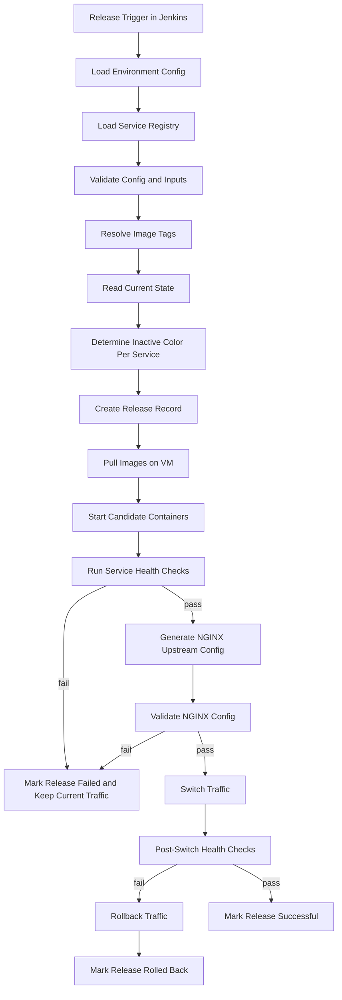
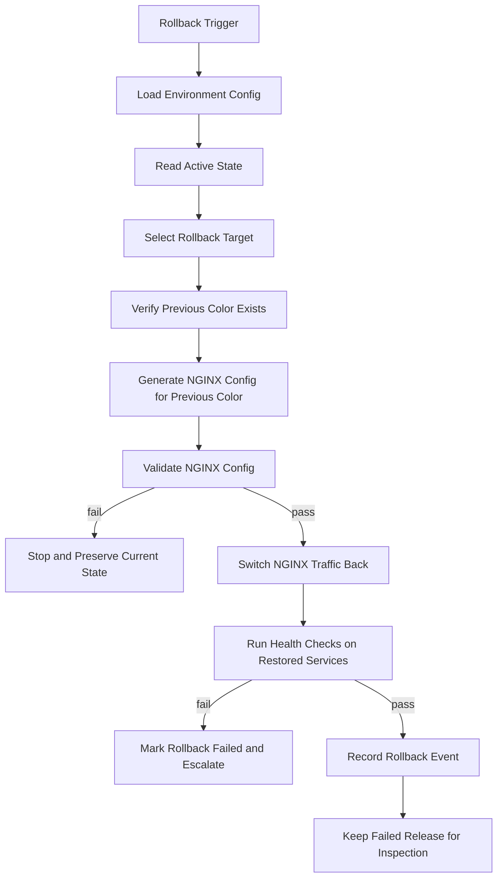

# Architecture

This document describes the planned `v1.0.0` architecture for a generic Linux VM-based zero-downtime CI/CD template. It is intentionally application-agnostic and focused on Jenkins, Docker-compatible service images, NGINX traffic switching, blue/green deployment slots, rollback, and release history tracking.

Kubernetes is future `v2.0.0` roadmap scope only and is not part of this architecture.

## Design Goals

- support many application stacks through configuration rather than application-specific scripts
- deploy one or more services to Linux VMs with the same release mechanics
- keep the currently healthy color serving traffic while candidates start on the inactive color
- promote only after service health checks and NGINX validation pass
- make rollback faster than debugging during an incident
- preserve release history for audits, incident review, and operator confidence
- keep the repository structure clear enough for contributors and recruiters to evaluate quickly

## Final Repository Tree

The complete `v1.0.0` repository should use this structure. Files marked as scripts are design targets only until implementation begins.

```text
.
├── README.md
├── CHANGELOG.md
├── LICENSE
├── .editorconfig
├── .env.example
├── .gitignore
├── Jenkinsfile
├── config/
│   ├── README.md
│   ├── environments/
│   │   ├── development.yml
│   │   ├── staging.yml
│   │   └── production.yml
│   ├── services.yml
│   └── nginx/
│       ├── nginx.conf.tpl
│       └── upstream.conf.tpl
├── docs/
│   ├── AI_AGENT_USAGE.md
│   ├── ARCHITECTURE.md
│   ├── CONFIGURATION.md
│   ├── CONTRIBUTING.md
│   ├── HEALTH_CHECK.md
│   ├── MVP.md
│   ├── OPERATIONS.md
│   ├── PRE_RELEASE_PLAN.md
│   ├── REAL_WORLD_PROBLEMS.md
│   ├── RELEASE_PLAN.md
│   ├── RELEASE_SCOPE.md
│   └── ROADMAP.md
├── examples/
│   ├── three-services/
│   │   ├── services.yml
│   │   └── production.yml
│   └── single-service/
│       ├── services.yml
│       └── staging.yml
├── scripts/
│   ├── common/
│   │   ├── colors.sh
│   │   ├── config.sh
│   │   ├── docker.sh
│   │   ├── logging.sh
│   │   ├── nginx.sh
│   │   └── state.sh
│   ├── deploy.sh
│   ├── generate-nginx.sh
│   ├── health-check.sh
│   ├── init-host.sh
│   ├── list-releases.sh
│   ├── rollback.sh
│   ├── smoke-test.sh
│   ├── switch-traffic.sh
│   └── validate-config.sh
└── tests/
    ├── fixtures/
    │   ├── services.valid.yml
    │   └── services.invalid.yml
    ├── test-config-validation.sh
    ├── test-nginx-generation.sh
    └── test-state-transitions.sh
```

The current repository may contain early scaffold files such as `demo-app/` or single-service examples. For `v1.0.0`, those should be treated as examples, not as the core deployment model.

## Configuration Format

The v1 configuration should be YAML, split between service registration and environment-specific deployment settings.

`config/services.yml` defines application-agnostic service metadata:

```yaml
version: 1
services:
  - name: api
    image: registry.example.com/company/api
    route:
      host: example.com
      path_prefix: /api
    ports:
      blue: 8101
      green: 8102
    health_check:
      path: /health
      expected_status: 200
      timeout_seconds: 3
      retries: 10
      interval_seconds: 3
    deploy:
      start_order: 10
      stop_grace_seconds: 20
      environment_file: api.env

  - name: web
    image: registry.example.com/company/web
    route:
      host: example.com
      path_prefix: /
    ports:
      blue: 8201
      green: 8202
    health_check:
      path: /healthz
      expected_status: 200
      timeout_seconds: 3
      retries: 10
      interval_seconds: 3
    deploy:
      start_order: 20
      stop_grace_seconds: 20
      environment_file: web.env
```

`config/environments/<environment>.yml` defines where and how the services run:

```yaml
environment: production
release_root: /opt/zero-downtime-cicd
state_root: /opt/zero-downtime-cicd/state
log_root: /opt/zero-downtime-cicd/logs
deployment_user: deploy
nginx:
  config_dir: /etc/nginx/conf.d
  generated_upstream_file: /etc/nginx/conf.d/zero-downtime-upstreams.conf
  reload_command: sudo systemctl reload nginx
  validate_command: sudo nginx -t
docker:
  network: zero-downtime
  registry: registry.example.com
release:
  keep_history: 20
  default_timeout_seconds: 300
```

Configuration rules:

- service names must be unique and stable
- each service must define blue and green ports
- health checks must be explicit per service
- routes must be explicit so NGINX generation is deterministic
- environment files may contain runtime values, but secrets must not be committed
- image tags should be supplied by Jenkins at release time, not hardcoded as mutable `latest`

## Service Registration Model

A service is registered by adding an entry to `config/services.yml`. The deployment engine should not require service-specific scripts for normal operation.

A registered service contains:

- `name` - stable identifier used in containers, state, logs, and release history
- `image` - repository path without assuming a specific application language
- `route` - NGINX host and path mapping
- `ports` - blue and green host ports
- `health_check` - readiness gate before promotion
- `deploy` - ordering, graceful stop behavior, and optional environment file reference

Service registration should support partial deployments. Jenkins may deploy all services for a release or a selected subset, but state must always record exactly which services were included.

## Deployment Workflow



Deployment guarantees are intentionally scoped. The template can avoid switching traffic to unhealthy candidates, but application compatibility, database safety, and external dependency behavior remain the responsibility of the application team.

## Rollback Workflow



Rollback should restore traffic first and clean up later. Failed candidates and logs should remain available until an operator has captured enough context for troubleshooting.

## State Management Design

Phase 2 uses per-service filesystem state under each registered service `deploy_path`. This keeps state close to the service it describes and lets operators inspect one service without parsing a global state document.

For each service:

```text
<deploy_path>/
├── releases/
├── shared/
├── state/
│   ├── active_color
│   ├── deploy.lock
│   └── history.log
└── current -> releases/<release_id>
```

Persistent state files:

- `state/active_color` stores the current active color, either `blue` or `green`.
- `state/history.log` stores append-only release history entries.
- `current` is a future symlink to the active release directory.

Transient state files:

- `state/deploy.lock` exists only while a future deployment operation holds the service lock.

Phase 2 provides the foundation only. It initializes directories and state files, reads active and inactive colors, creates and releases lock files, appends history entries, and reads the latest history entry. It does not deploy releases, modify the `current` symlink, switch NGINX traffic, or perform rollback.

State update rules:

- initialize missing state without overwriting existing state
- preserve `active_color` if it already exists
- preserve `history.log` if it already exists
- use `deploy.lock` to prevent concurrent future deployments per service
- append release history instead of rewriting it
- avoid deleting service state as part of initialization or inspection

## Phase 2 State Commands

Initialize a service state layout:

```bash
./scripts/init-service.sh billing-api
make init-service SERVICE=billing-api
```

Inspect service state:

```bash
./scripts/show-state.sh billing-api
make show-state SERVICE=billing-api
```

## NGINX Generation Strategy

NGINX configuration should be generated from `config/services.yml`, environment settings, and current or candidate color selection. Operators should not manually edit generated upstream files during normal deployment.

The strategy:

1. Render an upstream block per service using the selected color port.
2. Render route rules from each service's `host` and `path_prefix`.
3. Write generated config to a temporary file.
4. Run `nginx -t` or the configured validation command.
5. Atomically move the generated file into the configured NGINX include path.
6. Reload NGINX with the configured reload command.
7. Run post-switch health checks through the public route where possible.

Template inputs:

- service name
- route host
- route path prefix
- active or candidate color
- host port for selected color
- proxy timeout defaults
- optional service-specific headers

Generated files should include a warning comment such as `# Generated by zero-downtime-cicd-template. Do not edit directly.`

## Release Directory Structure

The target VM uses the service `deploy_path` from `config/services.yml`. Local examples use `/tmp/zero-downtime-cicd/services/<service-name>` so contributors can test without root privileges. Production VM configurations should prefer `/opt/apps/<service-name>` or another operator-approved application root.

```text
<deploy_path>/
├── releases/
│   └── <release_id>/
│       ├── artifact/
│       └── release.json
├── shared/
├── state/
│   ├── active_color
│   ├── deploy.lock
│   └── history.log
└── current -> releases/<release_id>
```

Directory responsibilities:

- `releases/` holds immutable release artifact directories.
- `release.json` stores release metadata such as `release_id`, creation time, source, Git commit, status, and retention count.
- `shared/` is reserved for service data that should survive release changes.
- `state/` contains service-local state, history, and lock files.
- `current` points to the most recently created release artifact directory.

Phase 4 creates release artifact directories, writes metadata, updates `current`, appends `history.log`, and applies retention cleanup. It does not start services, change `state/active_color`, switch NGINX traffic, run Jenkins, or perform rollback.

## Release ID and Retention

Release IDs use UTC timestamp plus a short Git hash when available:

```text
YYYYMMDDTHHMMSSZ-<short_git_hash>
YYYYMMDDTHHMMSSZ-nogit
```

Each service may define `retention_count` in `config/services.yml`. If omitted, the default is `5`. Values greater than `10` produce a warning so operators notice unusually high local disk retention.

Retention cleanup rules:

- delete only directories under `<deploy_path>/releases/`
- never delete the release pointed to by `current`
- never delete the latest successful release in `state/history.log`
- delete only releases older than the retained count
- log every deletion and protected skip

Rollback implication: Phase 4 does not implement rollback, but preserving `current`, the latest successful release, and history entries keeps enough release artifact context for a future rollback command.

## Example Configuration for Three Services

```yaml
version: 1
services:
  - name: api
    image: registry.example.com/acme/api
    route:
      host: app.example.com
      path_prefix: /api
    ports:
      blue: 8101
      green: 8102
    health_check:
      path: /health
      expected_status: 200
      timeout_seconds: 3
      retries: 12
      interval_seconds: 5
    deploy:
      start_order: 10
      stop_grace_seconds: 30
      environment_file: api.env

  - name: worker
    image: registry.example.com/acme/worker
    route:
      host: internal.example.com
      path_prefix: /worker-health
    ports:
      blue: 8301
      green: 8302
    health_check:
      path: /health
      expected_status: 200
      timeout_seconds: 3
      retries: 12
      interval_seconds: 5
    deploy:
      start_order: 20
      stop_grace_seconds: 45
      environment_file: worker.env

  - name: web
    image: registry.example.com/acme/web
    route:
      host: app.example.com
      path_prefix: /
    ports:
      blue: 8201
      green: 8202
    health_check:
      path: /healthz
      expected_status: 200
      timeout_seconds: 3
      retries: 10
      interval_seconds: 3
    deploy:
      start_order: 30
      stop_grace_seconds: 20
      environment_file: web.env
```

Example image tags should be supplied at deployment time:

```text
api=registry.example.com/acme/api:1.4.2
worker=registry.example.com/acme/worker:0.9.7
web=registry.example.com/acme/web:2.8.0
```

## Phase 3 Health Validation Foundation

Phase 3 introduces reusable health validation primitives for future deployments:

- `scripts/healthcheck.sh` checks any HTTP URL and succeeds only on `2xx`.
- `scripts/lib/health.sh` builds health URLs and wraps common validation behavior.
- `scripts/validate-release.sh` validates one registered service candidate port using the service `health_path`.
- `examples/mock-health-server/` provides a local shell-only endpoint for validation.

Release validation depends on Phase 1 configuration and Phase 2 service state. It verifies that a service exists, state has been initialized, and the candidate health endpoint responds successfully. It does not create releases, update state, switch NGINX traffic, run Jenkins, or roll back.

Future deployment phases should call release validation after starting the inactive color and before promotion.

## Phase 5 Runtime Process Foundation

Phase 5 introduces a runtime abstraction for managing blue/green service instances on Linux VMs.

The v1 foundation supports only:

```yaml
runtime: container
```

Unsupported runtimes must fail clearly. The runtime layer uses Docker for container operations and follows this container naming convention:

```text
<service_name>-<color>
```

Examples:

```text
billing-api-blue
billing-api-green
```

For the built-in mock artifact mode, a release containing `artifact/app.txt` can be started with a lightweight demo HTTP container. The container serves `/health` with HTTP `200` and `/` with service, color, release, and artifact metadata.

Inactive color start flow:

1. validate service configuration
2. confirm service state is initialized
3. confirm the release directory exists
4. resolve the requested color port from `config/services.yml`
5. start only `<service_name>-<color>`
6. mount the release artifact directory read-only
7. expose the selected blue/green port
8. label the container with service, color, and release ID

Phase 5 intentionally does not switch traffic. Starting a color only proves that a candidate process can run on its assigned port. Traffic switching belongs to a later NGINX phase after health validation and operator-controlled promotion semantics are defined.

## Phase 6 NGINX Generation Foundation

Phase 6 generates NGINX config files from the service registry and current service state. Generated files are written to `build/nginx` by default so operators can review and validate them before any production install step.

Generation reads:

- `nginx_server_name`
- `public_port`
- `service_name`
- `health_path`
- `active_color` from service state
- blue or green upstream port based on `active_color`

The generated service config includes one upstream pointing at the active color port, a server block listening on the configured public port, health path proxying, root path proxying, and common proxy headers.

Production install path recommendation for a future traffic-switch phase:

```text
/etc/nginx/conf.d/zero-downtime/<service>.conf
```

Phase 6 does not write to that path, reload NGINX, switch traffic, update `active_color`, implement rollback, or call Jenkins.

## Phase 7 Controlled Traffic Switching

Phase 7 introduces controlled NGINX traffic switching for one service at a time.

Switch workflow:

1. validate `config/services.yml`
2. confirm the service is registered
3. confirm service state exists
4. validate target color is `blue` or `green`
5. confirm the target color container is running
6. health-check the target color port
7. generate an NGINX config using the target color port
8. install the generated config into a safe configurable output path
9. validate generated NGINX config before reload
10. reload NGINX
11. update `state/active_color` only after successful reload
12. append a traffic switch history entry

Default install path is safe and local:

```text
./build/nginx-installed
```

Production recommended install path for a future operational setup:

```text
/etc/nginx/conf.d/zero-downtime/<service>.conf
```

The default reload command is `nginx -s reload`. Operators can override it with `NGINX_RELOAD_CMD`, for example `NGINX_RELOAD_CMD="sudo systemctl reload nginx"`.

Dry-run mode validates inputs, generates target-color config, shows the intended install path and reload command, and does not copy config, reload NGINX, or update `active_color`.

The old color remains running until an operator explicitly stops it. Phase 7 does not implement rollback or Jenkins orchestration.

## Phase 8 Rollback Support

Phase 8 adds one-service rollback orchestration.

Rollback workflow:

1. validate service configuration
2. confirm service state exists
3. read current `active_color`
4. choose the inactive color as rollback target
5. select a rollback release
6. start the rollback release on the inactive color
7. health-check the inactive color port
8. switch traffic to the inactive color with `switch-traffic.sh`
9. append rollback history

Default rollback selection uses the previous retained successful release from `state/history.log`, excluding the current release symlink. Operators can choose a retained release manually with `--release <release_id>`.

Rollback does not delete release artifacts and does not stop the old active color automatically. Retention limits still apply, so only retained release directories can be selected.

Dry-run mode prints the selected release, target color, candidate port, release directory, and intended start/health/switch commands without starting containers, reloading NGINX, switching traffic, or updating `active_color`.

## Phase 9 Deployment Orchestrator

Phase 9 adds the main one-service deployment orchestrator, `scripts/deploy.sh`.

Deployment workflow:

1. validate service configuration
2. confirm the service exists
3. initialize service state if needed
4. read active color
5. choose inactive color as target
6. create a release from the artifact source
7. start the target color with the new release
8. health-check the target color port
9. switch traffic to the target color
10. append deployment history
11. leave the old active color running

Dry-run prints the planned release creation, target color, target port, health URL, and intended switch command. It does not create a release, start a container, reload NGINX, switch traffic, update `active_color`, or clean up artifacts.

Failure safety: if release creation, target startup, health validation, or traffic switching fails, the previous active color remains unchanged. Failed release artifacts are retained for inspection.

## Required v1.0.0 Scripts

These scripts are required for `v1.0.0`, but this document does not implement them.

| Script | Responsibility |
| --- | --- |
| `scripts/init-host.sh` | Create target VM directories, validate required tools, and prepare Docker network assumptions. |
| `scripts/validate-config.sh` | Validate service and environment YAML before deployment. |
| `scripts/deploy.sh` | Orchestrate one-service release creation, inactive color startup, health validation, and traffic switch. |
| `scripts/health-check.sh` | Run HTTP health checks with timeout and retry behavior. |
| `scripts/generate-nginx.sh` | Render NGINX config into `build/nginx` from service registration and active color state. |
| `scripts/validate-nginx.sh` | Validate generated NGINX config statically and with `nginx -t` when available. |
| `scripts/switch-traffic.sh` | Health-check a target color, install validated NGINX config, reload NGINX, and update active color after success. |
| `scripts/rollback.sh` | Start a retained release on the inactive color, health-check it, switch traffic, and record rollback state. |
| `scripts/list-releases.sh` | Show retained release artifacts and release metadata. |
| `scripts/start-color.sh` | Start one service color container from an existing release artifact. |
| `scripts/stop-color.sh` | Stop and remove only one named service color container. |
| `scripts/status-color.sh` | Show existence, running state, mapped port, and release label for one service color. |
| `scripts/smoke-test.sh` | Run optional post-switch checks against public routes. |
| `scripts/lib/service-discovery.sh` | Read service registry entries. |
| `scripts/lib/state.sh` | Read, lock, write, and inspect service state. |
| `scripts/lib/health.sh` | Build health URLs and execute health validation. |
| `scripts/lib/release.sh` | Create release IDs, release directories, metadata, symlinks, and retention cleanup. |
| `scripts/lib/runtime.sh` | Resolve runtime settings and manage blue/green color containers. |
| `scripts/lib/nginx.sh` | Resolve NGINX inputs, render service config, and validate generated config. |

## Jenkins Integration

`Jenkinsfile` should call the scripts rather than embedding deployment logic directly. The planned stages are:

1. checkout
2. validate configuration
3. resolve service image tags
4. initialize or verify target host
5. deploy inactive color
6. run candidate health checks
7. generate and validate NGINX config
8. switch traffic
9. run post-switch verification
10. record release result
11. expose rollback action

Jenkins should capture release metadata including build URL, Git commit, target environment, service list, image tags, operator, and result.

## Future Architecture

The future `v2.0.0` roadmap targets Kubernetes, Helm, rolling and blue/green strategies, and a cloud-native deployment workflow. Those concepts should not be implemented in the v1 VM architecture.
