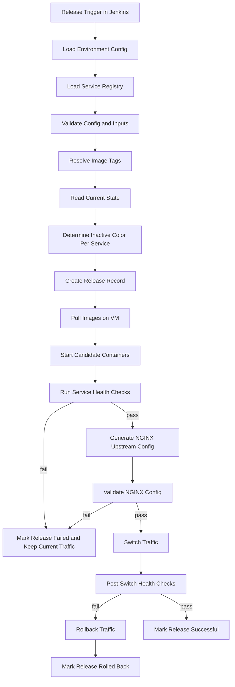
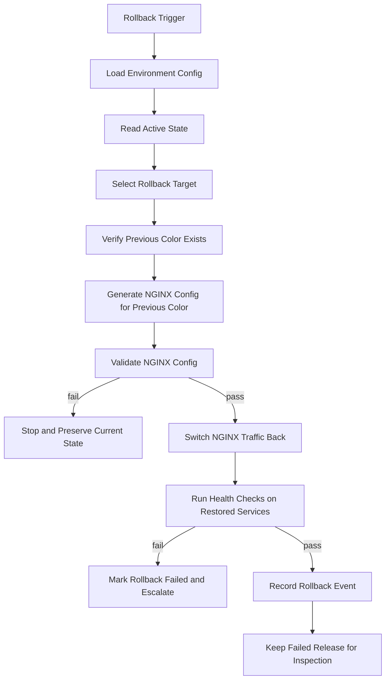

# Architecture

This document describes the `v1.0.0` architecture for a generic Linux VM-based zero-downtime CI/CD template. It is intentionally application-agnostic and focused on Jenkins, Docker-compatible service images, NGINX or Apache traffic switching, blue/green deployment slots, rollback, and release history tracking.

Kubernetes is future `v2.0.0` roadmap scope only and is not part of this architecture.

## Design Goals

- support many application stacks through configuration rather than application-specific scripts
- deploy one or more services to Linux VMs with the same release mechanics
- keep the currently healthy color serving traffic while candidates start on the inactive color
- promote only after service health checks and configured proxy validation pass
- make rollback faster than debugging during an incident
- preserve release history for audits, incident review, and operator confidence
- keep the repository structure clear enough for contributors and recruiters to evaluate quickly

## Final Repository Tree

The `v1.0.0` repository is organized around configuration, scripts, NGINX and Apache templates, Jenkins examples, and operator documentation.

```text
.
├── README.md
├── CHANGELOG.md
├── Jenkinsfile
├── Makefile
├── config/
│   ├── services.yml
│   ├── environments/
│   └── examples/
├── docs/
│   ├── ARCHITECTURE.md
│   ├── CONFIGURATION.md
│   ├── HEALTH_CHECK.md
│   ├── OPERATIONS.md
│   ├── QUICK_START.md
│   ├── RELEASE_CHECKLIST.md
│   ├── RELEASE_SCOPE.md
│   ├── ROADMAP.md
│   └── TROUBLESHOOTING.md
├── examples/
│   ├── jenkins/
│   ├── mock-artifact/
│   └── mock-health-server/
├── nginx/
│   └── templates/service.conf.tpl
└── scripts/
    ├── lib/
    ├── deploy.sh
    ├── rollback.sh
    ├── switch-traffic.sh
    └── release, runtime, health, state, config, and NGINX and Apache commands
```

## Configuration Format

The v1 configuration is YAML, split between service registration and environment-specific settings.

`config/services.yml` defines application-agnostic service metadata:

```yaml
services:
  - service_name: billing-api
    runtime: systemd
    public_port: 8080
    blue_port: 8860
    green_port: 8861
    health_path: /api/v1/health
    deploy_path: /opt/apps/billing-api
    nginx_server_name: _
    retention_count: 5
    start_command: sudo systemctl start billing-api-{color}
    stop_command: sudo systemctl stop billing-api-{color}
    status_command: sudo systemctl is-active billing-api-{color}
    env_file: /opt/apps/billing-api/shared/.env
```

`config/environments/<environment>.yml` captures environment-level operator context. Service deploy paths remain explicit per service so local validation can use safe paths and production VMs can use durable paths.

Local validation path recommendation:

```text
/tmp/zero-downtime-cicd/services/<service-name>
```

Production path recommendation:

```text
/opt/apps/<service-name>
```

Configuration rules:

- service names must be unique and stable
- ports must be unique across registered services
- blue and green ports must differ
- health paths must begin with `/`
- deploy paths must be absolute
- runtime support is `runtime: systemd` or `runtime: container` for v1
- secrets must not be committed to configuration files

## Service Registration Model

A service is registered by adding an entry to `config/services.yml`. The deployment scripts do not require service-specific code for normal operation.

A registered service contains:

- `service_name` - stable identifier used in containers, state, logs, and release history
- `runtime` - v1 supports `systemd` and `container`
- `public_port` - public proxy listen port for the service
- `blue_port` and `green_port` - host ports for blue/green service instances
- `health_path` - readiness endpoint used before promotion
- `deploy_path` - filesystem root for releases, state, and shared files
- `nginx_server_name` - generated NGINX server name; Apache uses it as ServerName unless `_`, which maps to `localhost`
- `retention_count` - retained release count, defaulting to `5` when omitted
- `start_command`, `stop_command`, and `status_command` - required for `runtime: systemd`
- `working_directory` and `env_file` - optional systemd runtime context fields
- `proxy_runtime` - optional proxy selector, `nginx` by default or `apache` for Apache HTTPD

Jenkins may deploy one service or iterate through multiple registered services, but each service keeps independent state and release history.

## Deployment Workflow



Deployment guarantees are intentionally scoped. The template can avoid switching traffic to unhealthy candidates, but application compatibility, database safety, and external dependency behavior remain the responsibility of the application team.

## Rollback Workflow



Rollback should restore traffic first and clean up later. Failed candidates and logs should remain available until an operator has captured enough context for troubleshooting.

## State Management Design

The v1 foundation uses per-service filesystem state under each registered service `deploy_path`. This keeps state close to the service it describes and lets operators inspect one service without parsing a global state document.

For each service:

```text
<deploy_path>/
├── releases/
├── shared/
├── state/
│   ├── active_color
│   ├── deploy.lock
│   └── history.log
└── current -> releases/<release_id>
```

Persistent state files:

- `state/active_color` stores the current active color, either `blue` or `green`.
- `state/history.log` stores append-only release history entries.
- `current` is a symlink to the latest created release artifact directory.

Transient state files:

- `state/deploy.lock` exists only while a deployment operation holds the service lock.

State update rules:

- initialize missing state without overwriting existing state
- preserve `active_color` if it already exists
- preserve `history.log` if it already exists
- use `deploy.lock` to prevent concurrent deployments per service
- append release history instead of rewriting it
- avoid deleting service state as part of initialization or inspection

## State Commands

Initialize a service state layout:

```bash
./scripts/init-service.sh billing-api
make init-service SERVICE=billing-api
```

Inspect service state:

```bash
./scripts/show-state.sh billing-api
make show-state SERVICE=billing-api
```

## Proxy Generation Strategy

NGINX or Apache configuration should be generated from `config/services.yml`, environment settings, and current or candidate color selection. Operators should not manually edit generated upstream files during normal deployment.

The strategy:

1. Render an upstream block per service using the selected color port.
2. Render route rules from each service's `host` and `path_prefix`.
3. Write generated config to a temporary file.
4. Run `nginx -t` or the configured validation command.
5. Atomically move the generated file into the configured proxy include path.
6. Reload the configured proxy with the configured reload command.
7. Run post-switch health checks through the public route where possible.

Template inputs:

- service name
- route host
- route path prefix
- active or candidate color
- host port for selected color
- proxy timeout defaults
- optional service-specific headers

Generated files should include a warning comment such as `# Generated by zero-downtime-cicd-template. Do not edit directly.`

## Release Directory Structure

The target VM uses the service `deploy_path` from `config/services.yml`. Local examples use `/tmp/zero-downtime-cicd/services/<service-name>` so contributors can test without root privileges. Production VM configurations should prefer `/opt/apps/<service-name>` or another operator-approved application root.

```text
<deploy_path>/
├── releases/
│   └── <release_id>/
│       ├── artifact/
│       └── release.json
├── shared/
├── state/
│   ├── active_color
│   ├── deploy.lock
│   └── history.log
└── current -> releases/<release_id>
```

Directory responsibilities:

- `releases/` holds immutable release artifact directories.
- `release.json` stores release metadata such as `release_id`, creation time, source, Git commit, status, and retention count.
- `shared/` is reserved for service data that should survive release changes.
- `state/` contains service-local state, history, and lock files.
- `current` points to the most recently created release artifact directory.

Release artifact commands create release directories, write metadata, update `current`, append `history.log`, and apply retention cleanup. They do not start services, change `state/active_color`, switch NGINX traffic, run Jenkins, or perform rollback by themselves.

## Release ID and Retention

Release IDs use UTC timestamp plus a short Git hash when available:

```text
YYYYMMDDTHHMMSSZ-<short_git_hash>
YYYYMMDDTHHMMSSZ-nogit
```

Each service may define `retention_count` in `config/services.yml`. If omitted, the default is `5`. Values greater than `10` produce a warning so operators notice unusually high local disk retention.

Retention cleanup rules:

- delete only directories under `<deploy_path>/releases/`
- never delete the release pointed to by `current`
- never delete the latest successful release in `state/history.log`
- delete only releases older than the retained count
- log every deletion and protected skip

Rollback depends on retained release directories, `current`, latest successful history entries, and explicit operator selection when needed.

## Example Configuration for Three Services

```yaml
services:
  - service_name: billing-api
    runtime: container
    public_port: 8080
    blue_port: 18080
    green_port: 18081
    health_path: /health
    deploy_path: /tmp/zero-downtime-cicd/services/billing-api
    nginx_server_name: billing.example.com
    retention_count: 5

  - service_name: photo-api
    runtime: container
    public_port: 8081
    blue_port: 18082
    green_port: 18083
    health_path: /health
    deploy_path: /tmp/zero-downtime-cicd/services/photo-api
    nginx_server_name: photos.example.com
    retention_count: 5

  - service_name: drive-api
    runtime: container
    public_port: 8082
    blue_port: 18084
    green_port: 18085
    health_path: /health
    deploy_path: /tmp/zero-downtime-cicd/services/drive-api
    nginx_server_name: drive.example.com
    retention_count: 5
```

## Health Validation Foundation

The health utilities provide reusable validation primitives for deployments:

- `scripts/healthcheck.sh` checks any HTTP URL and succeeds only on `2xx`.
- `scripts/lib/health.sh` builds health URLs and wraps common validation behavior.
- `scripts/validate-release.sh` validates one registered service candidate port using the service `health_path`.
- `examples/mock-health-server/` provides a local shell-only endpoint for validation.

Release validation depends on service configuration and initialized service state. It verifies that a service exists, state has been initialized, and the candidate health endpoint responds successfully. Deployment, switch, and rollback flows call health validation after starting the inactive color and before promotion.

## Runtime Process Foundation

The runtime abstraction manages blue/green service instances on Linux VMs.

The v1 foundation supports:

```yaml
runtime: systemd
runtime: container
```

`runtime: systemd` is recommended for no-Docker Linux VM deployments. Systemd services should use deterministic blue/green unit names such as:

```text
billing-api-blue
billing-api-green
```

`runtime: container` remains available for Docker-backed deployments and demo validation. Container operations follow this naming convention:

```text
<service_name>-<color>
```

Examples:

```text
billing-api-blue
billing-api-green
```

For the built-in container mock artifact mode, a release containing `artifact/app.txt` can be started with a lightweight demo HTTP container. The container serves `/health` with HTTP `200` and `/` with service, color, release, and artifact metadata.

Inactive color start flow:

1. validate service configuration
2. confirm service state is initialized
3. confirm the release directory exists
4. resolve the requested color port from `config/services.yml`
5. start only `<service_name>-<color>`
6. run the configured systemd command or mount the release artifact directory read-only for container mode
7. expose or use the selected blue/green port
8. label the container with service, color, and release ID when using container mode

Starting a color does not switch traffic. It proves that a candidate process can run on its assigned port before health validation and operator-controlled promotion.

## NGINX And Apache Generation Foundation

NGINX generation creates config files under `build/nginx`. Apache generation creates reverse proxy VirtualHost files under `build/apache`. Both read service registry and color state so operators can review and validate configs before any production install step.

Generation reads:

- `nginx_server_name`
- `public_port`
- `service_name`
- `health_path`
- `active_color` from service state
- blue or green upstream port based on `active_color`

The generated NGINX config includes an upstream and server block. The generated Apache config includes `<VirtualHost *:80>`, `ProxyPass`, `ProxyPassReverse`, `ProxyPreserveHost`, and forwarded headers. Apache requires modules `proxy`, `proxy_http`, and `headers`.

Production install path recommendation:

```text
/etc/nginx/conf.d/zero-downtime/<service>.conf
```

Proxy generation alone does not write to that path, reload the configured proxy, switch traffic, update `active_color`, perform rollback, or call Jenkins.

## Controlled Traffic Switching

Traffic switching moves one service to a target color at a time.

Switch workflow:

1. validate `config/services.yml`
2. confirm the service is registered
3. confirm service state exists
4. validate target color is `blue` or `green`
5. confirm the target color container is running
6. health-check the target color port
7. generate an NGINX or Apache config using the target color port
8. install the generated config into a safe configurable output path
9. validate generated proxy config before reload
10. reload the configured proxy
11. update `state/active_color` only after successful reload
12. append a traffic switch history entry

Default install path is safe and local:

```text
./build/nginx-installed
```

Production recommended install path:

```text
/etc/nginx/conf.d/zero-downtime/<service>.conf
```

Default reload commands are `nginx -s reload` and `apache2ctl graceful`. Operators can override them with `NGINX_RELOAD_CMD` or `APACHE_RELOAD_CMD`, for example `APACHE_RELOAD_CMD="sudo systemctl reload apache2"`.

Dry-run mode validates inputs, generates target-color config, shows the intended install path and reload command, and does not copy config, reload the configured proxy, or update `active_color`.

The old color remains running until an operator explicitly stops it.

## Rollback Support

Rollback orchestration operates on one service at a time.

Rollback workflow:

1. validate service configuration
2. confirm service state exists
3. read current `active_color`
4. choose the inactive color as rollback target
5. select a rollback release
6. start the rollback release on the inactive color
7. health-check the inactive color port
8. switch traffic to the inactive color with `switch-traffic.sh`
9. append rollback history

Default rollback selection uses the previous retained successful release from `state/history.log`, excluding the current release symlink. Operators can choose a retained release manually with `--release <release_id>`.

Rollback does not delete release artifacts and does not stop the old active color automatically. Retention limits still apply, so only retained release directories can be selected.

Dry-run mode prints the selected release, target color, candidate port, release directory, and intended start/health/switch commands without starting containers, reloading NGINX, switching traffic, or updating `active_color`.

## Deployment Orchestrator

`scripts/deploy.sh` is the main one-service deployment orchestrator.

Deployment workflow:

1. validate service configuration
2. confirm the service exists
3. initialize service state if needed
4. read active color
5. choose inactive color as target
6. create a release from the artifact source
7. start the target color with the new release
8. health-check the target color port
9. switch traffic to the target color
10. append deployment history
11. leave the old active color running

Dry-run prints the planned release creation, target color, target port, health URL, and intended switch command. It does not create a release, start a container, reload the configured proxy, switch traffic, update `active_color`, or clean up artifacts.

Failure safety: if release creation, target startup, health validation, or traffic switching fails, the previous active color remains unchanged. Failed release artifacts are retained for inspection.

## Required v1.0.0 Scripts

The current v1.0.0 command surface is:

| Script | Responsibility |
| --- | --- |
| `scripts/validate-config.sh` | Validate service YAML before deployment. |
| `scripts/init-service.sh` | Initialize per-service release and state directories. |
| `scripts/show-state.sh` | Inspect active color, current release, history, and lock state. |
| `scripts/healthcheck.sh` | Run HTTP health checks with timeout and retry behavior. |
| `scripts/validate-release.sh` | Validate a registered service candidate port. |
| `scripts/create-release.sh` | Create release artifact directories, metadata, history, and retention cleanup. |
| `scripts/list-releases.sh` | Show retained release artifacts and release metadata. |
| `scripts/start-color.sh` | Start one service color container from an existing release artifact. |
| `scripts/stop-color.sh` | Stop and remove only one named service color container. |
| `scripts/status-color.sh` | Show existence, running state, mapped port, and release label for one service color. |
| `scripts/generate-nginx.sh` | Render NGINX config into `build/nginx` from service registration and active color state. |
| `scripts/validate-nginx.sh` | Validate generated NGINX config statically and with `nginx -t` when available. |
| `scripts/generate-apache.sh` | Render Apache reverse proxy config into `build/apache` from service registration and active color state. |
| `scripts/validate-apache.sh` | Validate generated Apache config statically and with `apache2ctl -t` when available. |
| `scripts/switch-traffic.sh` | Health-check a target color, install validated NGINX config, reload the configured proxy, and update active color after success. |
| `scripts/rollback.sh` | Start a retained release on the inactive color, health-check it, switch traffic, and record rollback state. |
| `scripts/deploy.sh` | Orchestrate one-service release creation, inactive color startup, health validation, and traffic switch. |

Helper libraries live under `scripts/lib/` for service discovery, state, health, release, runtime, NGINX, and Apache behavior.

## Jenkins Integration

`Jenkinsfile` calls repository scripts rather than embedding deployment logic directly. The stages are:

1. checkout
2. validate configuration
3. prepare artifact
4. run deploy dry-run
5. require production approval when needed
6. run live deploy when `DRY_RUN=false`
7. show post-deployment state
8. print rollback instructions on failure

Jenkins should capture release metadata including build URL, Git commit, target environment, service list, image tags, operator, and result.

## Future Architecture

The future `v2.0.0` roadmap targets Kubernetes, Helm, rolling and blue/green strategies, and a cloud-native deployment workflow. Those concepts should not be implemented in the v1 VM architecture.
