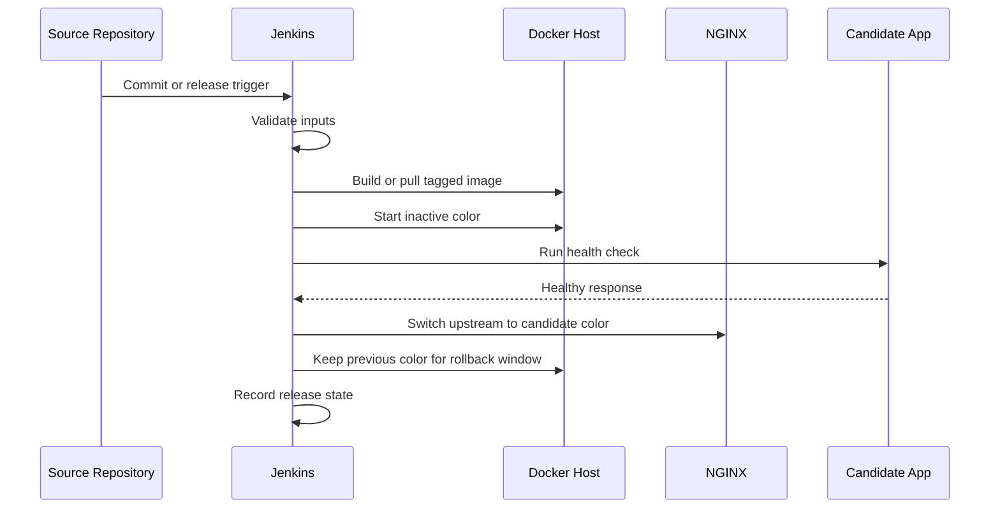
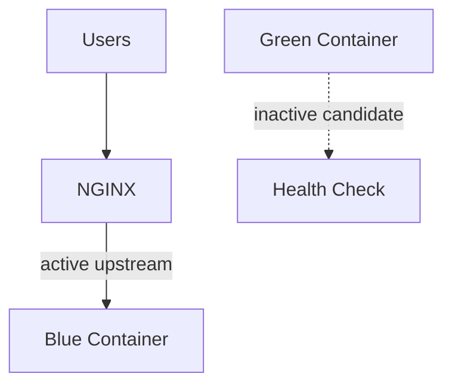
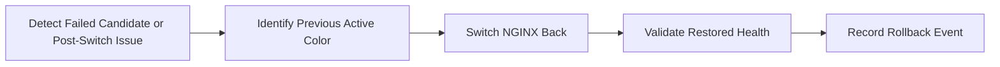

# Architecture

This document describes the intended architecture for the initial template. Implementation details may evolve as the MVP is built and tested.

## High-Level Deployment Flow

## Jenkins Role

Jenkins is planned as the release orchestrator. It should coordinate checkout, image build, tagging, deployment, validation, traffic switch, and rollback stages. Jenkins should expose enough logs and release metadata for operators to understand what changed and why.

Jenkins should not hide production risk behind a green build. A pipeline run is only meaningful when deployment validation, traffic switching, and rollback behavior are explicit.

## Docker Role

Docker provides the packaging and runtime boundary for application releases. The template will use tagged images to keep releases identifiable and repeatable. The active and inactive colors should run as separate containers or container groups with predictable names.

## NGINX Role

NGINX is the planned traffic boundary. It will route client traffic to the currently active color and be reloaded or reconfigured during promotion. NGINX changes must be validated carefully because incorrect upstream configuration can create immediate downtime.

## Blue/Green Deployment Concept

Blue/green deployment keeps two release slots available:

- **Blue:** one deployment color, either active or inactive.
- **Green:** the alternate deployment color, either active or inactive.

Only one color receives production traffic at a time. The inactive color is used for candidate deployment and health validation.

## Health Check Gate

The health check gate prevents traffic promotion when the candidate release cannot prove basic readiness. The MVP should support a configurable health endpoint and timeout policy. A failed health check should keep traffic on the current active color.

## Rollback Flow

Rollback should prefer restoring traffic to the last known healthy color before attempting deeper debugging.

## Environment Separation

Development, staging, and production should use the same deployment mechanics with different configuration values. The template should keep environment-specific settings explicit and should avoid embedding secrets in repository files.

Planned environment concerns include:

- application port
- health-check path
- image registry and tag
- NGINX upstream path
- release state location
- deployment user and permissions
- approval requirements

## Future Architecture Direction

Future releases may add deployment governance, observability, smoke tests, multi-service coordination, and canary-style validation. Larger orchestration platforms such as Kubernetes are intentionally outside the initial MVP but may influence future design notes.

