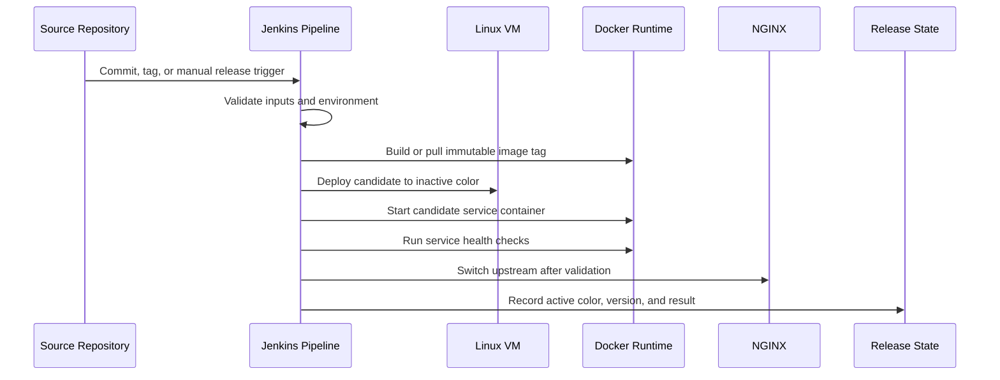
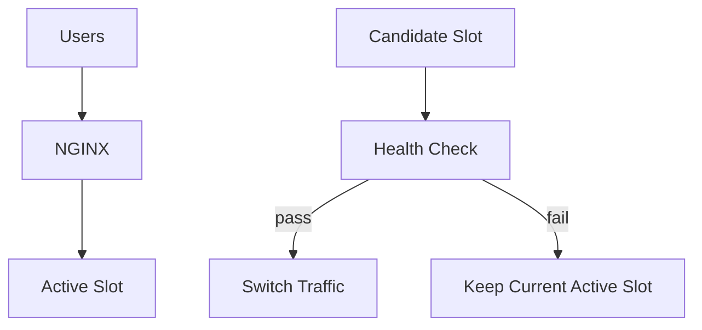
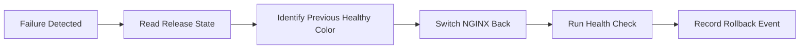

# Architecture

This document describes the planned `v1.0.0` architecture for a Linux VM-based zero-downtime CI/CD template. It is intentionally focused on virtual machines, Jenkins, Docker, NGINX, health checks, rollback, and release state management.

Kubernetes is future `v2.0.0` roadmap scope only and is not part of this architecture.

## Design Goals

- make releases repeatable instead of manual
- keep the currently healthy version serving traffic while a candidate starts
- promote only after health checks pass
- make rollback faster than debugging during an incident
- support more than one service without duplicating the whole deployment system
- keep operational state clear enough for humans to inspect

## High-Level Flow



## Core Components

### Jenkins

Jenkins is the release orchestrator. It should coordinate checkout, build or image selection, environment validation, deployment, health checks, NGINX switching, release-state updates, and rollback actions.

The pipeline must treat deployment success as more than a green build. A release is successful only when the candidate is deployed, validated, promoted, and recorded.

### Linux VM

The v1 target is a generic Linux VM. The template should avoid assumptions that only work on one cloud provider. Operators are expected to provide the VM, network access, Docker runtime, NGINX, deployment user permissions, and secret-management approach.

### Docker

Docker is the application packaging and runtime layer for v1. Images should be tagged immutably so operators can identify exactly what is running and roll back to a known release.

### NGINX

NGINX is the traffic boundary. It routes user traffic to the active blue or green slot. Promotion updates the NGINX upstream target and reloads or applies the change safely.

### Release State

Release state records what version is active, which color is live, which release was previously healthy, and whether the last deployment succeeded or rolled back. State should be simple enough to inspect during an incident.

## Blue/Green Model

Each service has two deployment slots:

- `blue` - one runnable version of the service
- `green` - the alternate runnable version of the service

Only one slot receives production traffic. The inactive slot is used for the candidate release.



## Multi-Service Deployment

`v1.0.0` should support multiple services without forcing every team to copy and edit separate deployment systems.

The expected model:

- define services in a structured configuration
- deploy each service to its inactive color
- run service-specific health checks
- support dependency-aware ordering where needed
- switch traffic only for services that pass their gates
- record per-service release state
- document rollback behavior when one service succeeds and another fails

The template should be honest about distributed-system limits. Multi-service rollback can be constrained by shared data, backward compatibility, and inter-service API changes.

## Health Checks

Health checks are promotion gates, not observability replacements. A candidate service must expose a configured HTTP endpoint that proves the process is running and ready to receive traffic.

Health-check behavior should define:

- endpoint path
- expected status code
- timeout
- retry count
- failure behavior
- post-switch verification

## Rollback

Rollback should prioritize restoring traffic to the last known healthy version.



Rollback does not automatically solve every application problem. Database changes, irreversible side effects, incompatible APIs, and external dependencies must be handled by the application and release process.

## Release Directory Structure

The planned v1 release layout should keep deployed assets and state predictable. A representative structure is:

```text
/opt/zero-downtime-cicd/
├── releases/
│   └── <service-name>/
│       ├── blue/
│       └── green/
├── state/
│   ├── active.json
│   └── history/
├── config/
│   ├── services/
│   └── environments/
└── logs/
```

The exact implementation may evolve, but documentation and scripts should keep release paths explicit.

## Environment Separation

Development, staging, and production should use the same deployment mechanics with different configuration values.

Environment-specific values may include:

- VM hostnames
- deployment user
- service ports
- health-check paths
- image registry and tags
- NGINX upstream paths
- release state location
- approval requirements
- secret references

Secrets must not be committed to the repository.

## Future Architecture

The future `v2.0.0` roadmap targets Kubernetes, Helm, rolling and blue/green strategies, and a cloud-native deployment workflow. Those concepts should not be implemented in the v1 VM architecture.
